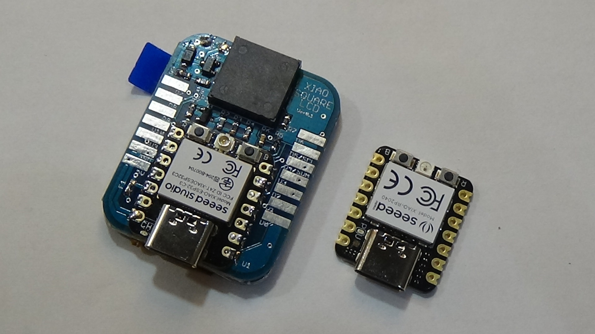

# XIAOスクエア液晶モジュール(XIAOは未実装です)

XIAOを実装した写真

SeeedStudioのXIAOを使用して1.69インチ240ｘ280ドットの角丸四角形液晶を駆動する基板モジュールです。

XIAO ESP32C2, XIAO RP2040, XIAO nrf52840Sense　で液晶が駆動出来る事を確認しています。

液晶の裏にXIAOを配置してしまいました。

余り領域にサウンダもつけてみました。

さらに、FET(AO3400A)を搭載してDCモータかソレノイドを１個駆動出来るようにしました。
　駆動出来る電流は5V入力電源側に依存しますが概ね500mA以下とお考え下さい。モータ・ソレノイド駆動時は負荷電流を十分に賄える電源を準備して、基板の5Vパットから供給して下さい。パソコンからのUSB給電で電流の大きいモーターを駆動すると動作が不安定になったり、XIAOおよび接続したパソコンのUSBポートを破損させる恐れがあります。

液晶にはst7789v2というコントローラーが使用されていますが、対応したグラフィックライブラリが数種類公開されています。

本モジュールは「グラフィックライブラリの使い方を理解して液晶モジュールを駆動出来る人」をターゲットにしております。

# 注意！！（必ずお読み下さい）

本品は基本的な電子回路の仕組みを理解した方を対象とした、電子部品がむき出しの半完成キットです。
電子部品は電源電圧や極性を間違えたり、部品を破損させたり部品端子をショートさせた場合、発熱・発煙・発火に至る場合もあります。
間違った使い方をすると危険である事を理解された方のみご使用ください。
趣味の電子工作向けに製作しておりますので、製品への組込みや日常生活へ組込んでのご使用はお止め下さい。

# 形状および回路図

以下に外形イメージを示します

以下に回路図を示します

2023年4月24日出荷分以降、輝度を上げるためにバックライトLEDの電流制限抵抗を39Ω2個に変更しています

# ピンアサイン

XIAO とLCDの制御信号とのピン接続は以下となります。

- SCLK:D8

- MOSI:D10

- DC:D0

- CS:D7

- RST:D1

- バックライト:D2　　バックライトLEDのPIN設定は必ず行ってください。未設定だと端子がハイインピーダンスとなりバックライトが不安定になります。

オマケ回路

- ブザー:D3
- FETドライブ:D9

なおD4,D5端子はI2C接続を想定してプルアップ抵抗10kΩを実装しています。

XIAOの各端子はSMTタイプのピンヘッダが実装できるパットを準備しました。ピンヘッダを実装すると外部との接続が簡単になります。

# 使用するツールやライブラリ

XIAOのArduino IDEへのインストールは、以下サイトを参考下さい。

https://wiki.seeedstudio.com/Seeeduino-XIAO/

グラフィックライブラリについては主にlovyan様のLovyanGFXにて動作確認をしています。

https://github.com/lovyan03/LovyanGFX

他、st7789に対応したライブラリが使用可能と考えています。

# デモプログラム

XIAO ESP32の動作確認プログラムです

https://github.com/urukakanko/XIAO_square_lcd/tree/main/xiaoESP32_square_lcd_MeterSample

XIAO RP2040の動作確認プログラムです

https://github.com/urukakanko/XIAO_square_lcd/tree/main/xiaorp2040_square_lcd_MeterSample

# そーたメイさま「つくるっち」に対応して頂きました

http://sohta02.web.fc2.com/familyday.html

XIAO RP2040　使用時のファームウェア

https://github.com/sohtamei/TuKuRutch.ext/blob/master/libraries/lovyanGFXpico/src/src.ino.uf2

つくるっちサンプルプログラム

https://sohta02.sakura.ne.jp/tukurutch/#000000531

setconfigブロックでSQUAREを選んでください

# LCD表示動画

つくるっちでLCDの表示と、ブザーとソレノイドを駆動させた例です　ネコのキャラクタが目玉のキャラクタにぶつかると、ブザーが鳴りソレノイドが動きます。

https://youtu.be/1hEku8byIqU

# 本製品を使用してタカハ機工の『第10回ソレコン』に応募しました結果、技術賞を頂きました！！

https://www.youtube.com/watch?v=jIElaem5278

# スイッチサイエンスマーケットプレイスで販売しています

https://www.switch-science.com/products/8524 

# 製作者

ウルカテクノロジー
Hiroyuki Sunagawa

https://www.facebook.com/URUKA-Technologies-105478404379918
